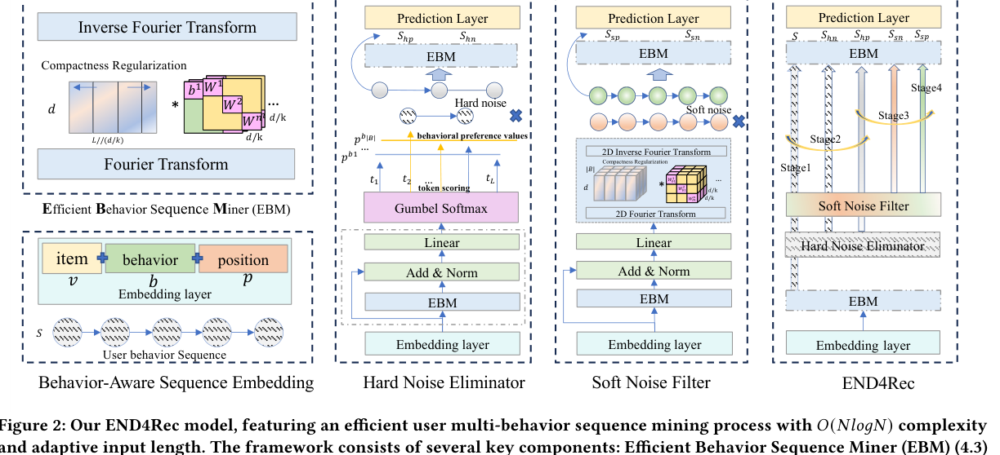
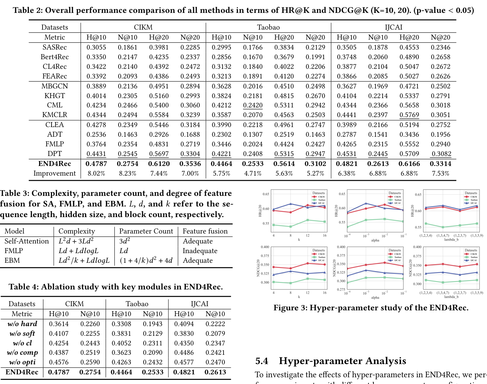

# END4Rec: Efficient Noise-Decoupling for Multi-Behavior Sequential Recommendation

[](https://ustc-starteam.github.io/End4Rec/)
[](https://doi.org/10.1145/3589334.3645380)
[](https://arxiv.org/abs/2403.17603)
[](https://www.mindspore.cn/)

MindSpore implementation for **"END4Rec: Efficient Noise-Decoupling for Multi-Behavior Sequential Recommendation"**.

END4Rec targets multi-behavior sequential recommendation, where user sequences can be long and noisy because different behaviors such as clicks, carts, and purchases carry different signals. The method combines efficient behavior sequence mining, hard/soft denoising, and noise-decoupling contrastive learning.

## 1. Paper

Yongqiang Han, Hao Wang, Kefan Wang, Likang Wu, Zhi Li, Wei Guo, Yong Liu, Defu Lian, and Enhong Chen. **END4Rec: Efficient Noise-Decoupling for Multi-Behavior Sequential Recommendation.** In *Proceedings of the ACM Web Conference 2024 (WWW 2024)*, Singapore, 2024.

[Paper](https://doi.org/10.1145/3589334.3645380) / [arXiv](https://arxiv.org/abs/2403.17603) / [PDF](https://arxiv.org/pdf/2403.17603) / [Project Page](https://ustc-starteam.github.io/End4Rec/) / [Code](https://github.com/USTC-StarTeam/End4Rec) / [Citation](#citation)

The paper addresses two issues in multi-behavior recommendation: long behavior sequences reduce modeling efficiency, and noisy behaviors interfere with user-interest modeling. END4Rec decouples useful behavior signals from noisy signals while keeping sequence mining efficient.

## 2. Highlights

- Introduces **Efficient Behavior Sequence Miner (EBM)** for low-complexity behavior pattern mining.
- Uses hard noise elimination at the token level and soft noise filtering at the representation level.
- Adds noise-decoupling contrastive learning and a guided four-stage training strategy.
- Provides a MindSpore implementation with runnable dummy-data fallback.

## 3. Method At A Glance



The framework combines behavior-aware sequence embedding, EBM, hard noise elimination, soft noise filtering, and multi-stage training to separate useful behavior information from noise.

## 4. Repository Structure

```text
.
|-- End4Rec/
|   |-- run.py                # CLI entry point
|   |-- train.py              # Main training flow and config loading
|   |-- trainer.py            # Four-stage training scheduler
|   |-- model.py              # END4Rec model
|   |-- ebm_enhanced.py       # EBM implementation
|   |-- losses.py             # Recommendation, contrastive, and regularization losses
|   |-- data.py / dataset.py  # Data loading and dataset construction
|   `-- evaluation.py         # HR / NDCG evaluation
|-- End4Rec.zip              # Original release archive
`-- docs/                    # Project page and README assets
```

## 5. Installation

Recommended environment:

- Python 3.9+
- MindSpore matched to your CUDA or Ascend environment

Quick check:

```bash
cd End4Rec
python -c "import mindspore; print(mindspore.__version__)"
```

## 6. Data / Models

Training CSV files should contain:

- `item_ids`: comma-separated item sequence
- `behavior_ids`: comma-separated behavior-type sequence
- `positions`: position sequence
- `label`: target item

Example:

```csv
item_ids,behavior_ids,positions,label
"10,11,23","1,2,1","0,1,2",42
```

## 7. Quick Start

Run the default configuration:

```bash
cd End4Rec
python run.py
```

If no data file is supplied, the code falls back to a dummy-data generator so the full training flow can be checked.

Run with a custom config:

```bash
cd End4Rec
python run.py --config config.json
```

## 8. Reproducing Results / Evaluation

The current implementation follows a four-stage training flow:

1. `embedding + ebm`
2. `hard_noise`
3. `soft_noise`
4. joint fine-tuning with `output_layer`

When `eval_data_file` is provided, training reports `HR@K` and `NDCG@K`. The default final checkpoint path is `End4Rec/end4rec_final.ckpt`.

## 9. Configuration Notes

Common config fields include `num_items`, `num_behaviors`, `seq_length`, `d_model`, `num_blocks`, `epsilon`, `batch_size`, `stage1~4_epochs`, `learning_rate_stage1~4`, `reg_weight`, `contrast_weight`, `train_data_file`, `eval_data_file`, `num_dummy_samples`, and `topk`.

## 10. Experimental Highlights



This experiment-page crop brings together the main HR/NDCG comparison, feature-fusion complexity table, ablation, and hyper-parameter curves used to support the repository summary.


The paper reports that END4Rec improves both efficiency and robustness for multi-behavior sequential recommendation by mining behavior patterns efficiently and decoupling different noise types.

| Dataset | END4Rec HR@10 / NDCG@10 | END4Rec HR@20 / NDCG@20 | Relative gain over strongest baseline |
| --- | --- | --- | --- |
| CIKM | 0.4787 / 0.2754 | 0.6120 / 0.3536 | +8.02% HR@10, +8.23% NDCG@10, +7.44% HR@20, +7.00% NDCG@20 |
| Taobao | 0.4464 / 0.2533 | 0.5614 / 0.3102 | +5.75% HR@10, +4.71% NDCG@10, +5.63% HR@20, +5.27% NDCG@20 |
| IJCAI | 0.4821 / 0.2613 | 0.6166 / 0.3314 | +6.38% HR@10, +6.88% NDCG@10, +6.88% HR@20, +7.53% NDCG@20 |

The complexity comparison reports that END4Rec's Efficient Behavior Miner keeps adequate feature fusion while avoiding the quadratic sequence cost of self-attention.

**Conclusion:** the improvements come from both the EBM architecture and the hard/soft noise decoupling strategy, not only from adding a larger sequential backbone.

## 11. Notes For Maintainers

- Keep the top-level README encoded as UTF-8.
- Store future README/project-page figures under `docs/assets/`.
- Add official slides, poster, or video links if WWW presentation materials become publicly available.

<a id="citation"></a>

## 12. Citation

```bibtex
@inproceedings{han2024end4rec,
  title = {END4Rec: Efficient Noise-Decoupling for Multi-Behavior Sequential Recommendation},
  author = {Han, Yongqiang and Wang, Hao and Wang, Kefan and Wu, Likang and Li, Zhi and Guo, Wei and Liu, Yong and Lian, Defu and Chen, Enhong},
  booktitle = {Proceedings of the ACM Web Conference 2024},
  year = {2024},
  doi = {10.1145/3589334.3645380},
  url = {https://doi.org/10.1145/3589334.3645380}
}
```

## 13. Contact

For paper questions, please contact:

- First author: Yongqiang Han (`harley@mail.ustc.edu.cn`)
- Corresponding author: Hao Wang (`wanghao3@ustc.edu.cn`)

For repository issues, please open a GitHub issue in this repository.
